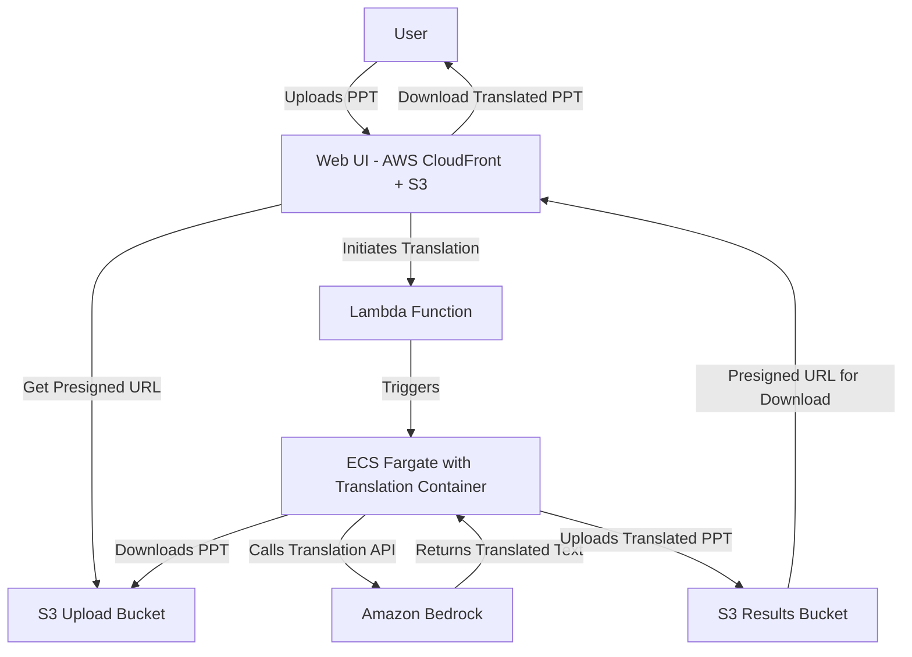

# PowerPoint Translator


## 🚀 Overview

PowerPoint Translator is a cutting-edge, serverless application that automates the translation of PowerPoint presentations between languages using generative AI. Built for the modern developer workflow of 2025, this app leverages AWS cloud services and advanced AI to deliver fast, accurate translations while preserving the original formatting and layout of your presentations.

## 🎯 Key Features

- **Seamless Upload Experience**: Drag-and-drop interface for simple presentation uploads
- **AI-Powered Translation**: Utilizes Amazon Bedrock's advanced language models for high-quality translations
- **Format Preservation**: Maintains the original PowerPoint formatting, styles, and layouts
- **Multiple Language Support**: Translate your presentations into various languages
- **Serverless Architecture**: Scales automatically with usage, no infrastructure management needed
- **Rapid Processing**: Parallel processing for quick turnaround of even large presentations
- **Secure Handling**: End-to-end encryption and temporary storage of your documents

## 🏗️ Architecture



## 🔧 Installation & Setup

### Prerequisites

- AWS Account with appropriate permissions
- Node.js v20+ and npm/yarn
- Python 3.12+
- AWS CDK v3.0+
- Docker (for local development)

### Local Development Setup

1. **Clone the repository**
   ```bash
   git clone https://github.com/yourusername/powerpoint-translator.git
   cd powerpoint-translator
   ```

2. **Install backend dependencies**
   ```bash
   cd translator-app
   pip install -r requirements.txt
   cd ..
   ```

3. **Install frontend dependencies**
   ```bash
   cd web-ui
   npm install
   cd ..
   ```

4. **Configure AWS credentials**
   ```bash
   aws configure
   ```

5. **Deploy infrastructure**
   ```bash
   npx aws-cdk deploy --all
   ```

6. **Start local development server**
   ```bash
   cd web-ui
   npm start
   ```

## 🚀 Deployment

The application uses a CI/CD pipeline that automatically deploys changes when code is pushed to the main branch:

1. **Frontend**: AWS CloudFront + S3 automatically rebuilds and deploys the React application
2. **Backend**: GitHub Actions workflow updates Lambda functions and container images
3. **Infrastructure**: CDK deployment updates any infrastructure changes

## 🤝 Contributing

Contributions are welcome! Check out the [contributing guidelines](CONTRIBUTING.md) to get started.

## 📄 License

This project is licensed under the Apache License 2.0 - see below for details:

```
Copyright 2025 PowerPoint Translator

Licensed under the Apache License, Version 2.0 (the "License");
you may not use this file except in compliance with the License.
You may obtain a copy of the License at

    http://www.apache.org/licenses/LICENSE-2.0

Unless required by applicable law or agreed to in writing, software
distributed under the License is distributed on an "AS IS" BASIS,
WITHOUT WARRANTIES OR CONDITIONS OF ANY KIND, either express or implied.
See the License for the specific language governing permissions and
limitations under the License.
```

## 📱 Contact & Support

- **Website**: https://ppt-translator.dev
- **Email**: support@ppt-translator.dev
- **Twitter**: [@PPTranslator](https://twitter.com/PPTranslator)
- **Discord**: [Join our community](https://discord.gg/ppt-translator)

---

*Built with 💙 by an indie developer in 2025*