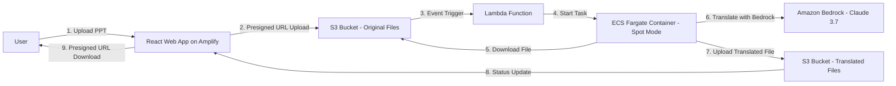

# PPT Translation App

## Project Overview
This application enables users to translate PowerPoint (PPT) presentations into different languages using AI translation capabilities from Amazon Bedrock (Claude 3.7). The system leverages AWS cloud infrastructure to provide a scalable and serverless solution for file processing.

## Project Goals
- Provide an intuitive web interface for uploading and downloading PPT files
- Enable secure file transfers using pre-signed URLs
- Automatically process translations using AWS Fargate containers
- Utilize Amazon Bedrock for high-quality AI-powered translations
- Maintain a serverless, scalable architecture that minimizes costs

## Architecture Overview


## Installation and Setup

### Prerequisites
- AWS Account with appropriate permissions
- Node.js (for CDK deployment)
- Docker (for local development of containers)
- AWS CLI configured with appropriate credentials

### Deployment Steps
1. Clone this repository
```bash
git clone https://github.com/your-org/ppt-translation-app.git
cd ppt-translation-app
```

2. Deploy infrastructure using AWS CDK
```bash
cd cdk
npm install
cdk deploy
```

3. Deploy the React web interface
```bash
cd ../web-ui
npm install
npm run build
```

4. Build and push the translator container
```bash
cd ../translator-app
docker build -t ppt-translator .
# Additional steps to push to ECR will be provided by CDK output
```

### Usage
1. Navigate to the deployed web application URL (provided in CDK output)
2. Upload a PowerPoint file using the web interface
3. Select the target language for translation
4. Wait for the translation process to complete
5. Download the translated file

## Components
- **Web UI**: React-based frontend deployed on AWS Amplify
- **Storage**: S3 buckets for original and translated files
- **Processing**: ECS Fargate containers (Spot mode) for cost-efficient translation
- **Translation**: Integration with Amazon Bedrock (Claude 3.7) for AI translation
- **Event Handling**: Lambda functions for triggering workflows on file upload

## License
```
Copyright 2023 [Your Organization]

Licensed under the Apache License, Version 2.0 (the "License");
you may not use this file except in compliance with the License.
You may obtain a copy of the License at

    http://www.apache.org/licenses/LICENSE-2.0

Unless required by applicable law or agreed to in writing, software
distributed under the License is distributed on an "AS IS" BASIS,
WITHOUT WARRANTIES OR CONDITIONS OF ANY KIND, either express or implied.
See the License for the specific language governing permissions and
limitations under the License.
```