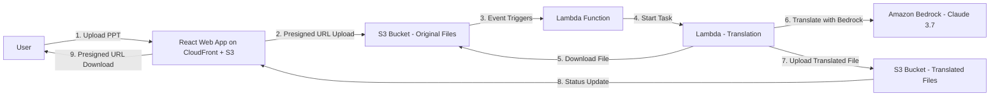

# PowerPoint Translator


## 🚀 Overview

PowerPoint Translator is a cutting-edge, serverless application that automates the translation of PowerPoint presentations between languages using generative AI. Built on AWS cloud services, this app leverages advanced AI to deliver fast, accurate translations while preserving the original formatting and layout of your presentations.

## 🎯 Key Features

- **Seamless Upload Experience**: Drag-and-drop interface for simple presentation uploads
- **AI-Powered Translation**: Utilizes Amazon Bedrock's Claude 3.7 model for high-quality translations
- **Format Preservation**: Maintains the original PowerPoint formatting, styles, and layouts
- **Traditional Chinese Support**: Currently focused on translation to Traditional Chinese (zh-TW)
- **Serverless Architecture**: Scales automatically with usage, no infrastructure management needed
- **Secure Handling**: End-to-end encryption and temporary storage of your documents

## 🏗️ Architecture



## 🔧 Installation & Setup

### Prerequisites

- AWS Account with appropriate permissions
- Node.js v20+ and npm/yarn
- Python 3.12+
- AWS CDK v3.0+

### Local Development Setup

1. **Clone the repository**
   ```bash
   git clone https://github.com/yourusername/powerpoint-translator.git
   cd powerpoint-translator
   ```

2. **Install dependencies**
   ```bash
   # Install root dependencies and link workspaces
   npm install
   
   # Install backend dependencies
   cd translator-app
   pip install -r requirements.txt
   cd ..
   ```

3. **Configure AWS credentials**
   ```bash
   aws configure
   ```

4. **Deploy infrastructure**
   ```bash
   # Deploy all resources
   npm run deploy
   
   # Or deploy just the CDK stack
   npm run deploy:cdk
   ```

5. **Start local development server**
   ```bash
   npm run start:web
   ```

## 🚀 Deployment

The application uses a monorepo structure with npm workspaces for easy deployment:

1. **Deploy everything at once**
   ```bash
   npm run deploy
   ```

2. **Deploy individual components**
   ```bash
   # Deploy just the infrastructure
   npm run deploy:cdk
   
   # Deploy just the frontend
   npm run deploy:web
   ```

3. **Update Lambda functions**
   ```bash
   # Create Lambda deployment package
   cd translator-app
   zip -r translator-app.zip *.py
   cd ..
   
   # Deploy CDK stack with updated Lambda code
   npm run deploy:cdk
   ```

## 📋 Project Structure

```
powerpoint-translator/
├── cdk/                    # AWS CDK infrastructure code
├── translator-app/         # Lambda functions for translation
│   ├── lambda-package/     # Lambda deployment package
│   ├── translation_handler.py  # Main translation logic
│   └── presigned_url_generator.py  # URL generation for S3
├── web-ui/                 # React frontend application
│   ├── public/             # Static assets
│   └── src/                # React source code
├── memory-bank/            # Project documentation
├── .gitignore              # Git ignore file
├── README.md               # Project overview
└── PRD.md                  # Product Requirements Document
```

## 🧪 Testing

1. **Infrastructure Testing**
   - Verify AWS resource creation via AWS Console
   - Test CDK deployment commands

2. **Lambda Function Testing**
   - Test presigned URL generation
   - Verify translation function with sample PPT files

3. **Frontend Testing**
   - Test user authentication flow
   - Verify file upload and download functionality
   - Test progress tracking and status updates

## 📈 Current Status

The project is currently in active development. See [memory-bank/progress.md](memory-bank/progress.md) for the latest status and upcoming tasks.

## 🤝 Contributing

Contributions are welcome! Please feel free to submit a Pull Request.

## 📄 License

This project is licensed under the Apache License 2.0 - see below for details:

```
Copyright 2025 PowerPoint Translator

Licensed under the Apache License, Version 2.0 (the "License");
you may not use this file except in compliance with the License.
You may obtain a copy of the License at

    http://www.apache.org/licenses/LICENSE-2.0

Unless required by applicable law or agreed to in writing, software
distributed under the License is distributed on an "AS IS" BASIS,
WITHOUT WARRANTIES OR CONDITIONS OF ANY KIND, either express or implied.
See the License for the specific language governing permissions and
limitations under the License.
```

## 📱 Contact & Support

For questions or support, please open an issue on this repository.

---

*Built with AWS services and generative AI*
