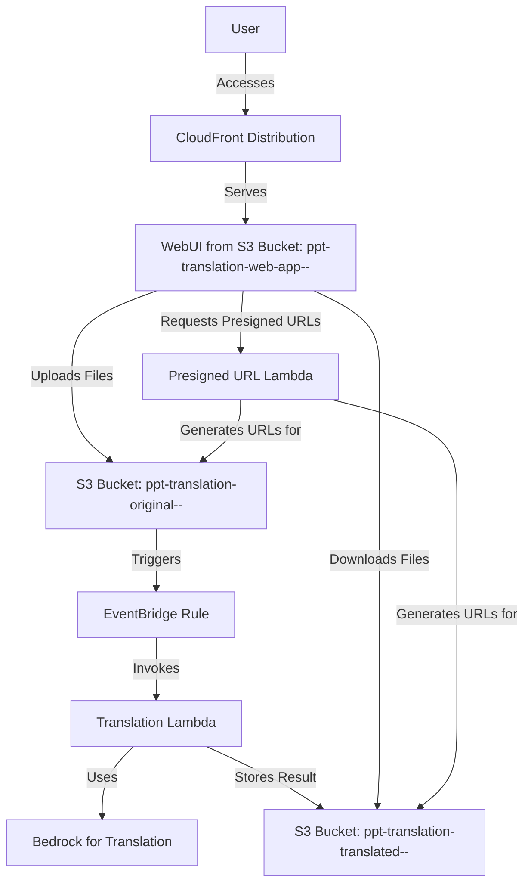

# Implementation Plan for PowerPoint Translator Infrastructure

## Overview
This document outlines the detailed plan for refactoring the PowerPoint Translator infrastructure to meet the user's requirements for unique bucket names, CDK stack simplification, endpoint access confirmation, local testing, and debugging support. The plan was approved by the user on May 7, 2025.

## 1. Refactor CDK Stack for Unique Bucket Names and Simplicity

**Objective:** Ensure that S3 bucket names for original and translated files are unique for each deployment, remove redundant or unnecessary components, and streamline the CDK code for efficiency.

- **Action 1.1: Update Bucket Naming Strategy**
  - Replace the fixed bucket names (`ppt-translation-original-files` and `ppt-translation-translated-files`) with dynamically generated names using a unique suffix based on the stack name and a timestamp or context value.
  - Create new S3 buckets instead of referencing existing ones to ensure uniqueness and independence per deployment.
  - Update the Lambda environment variables to reflect these new bucket names.

- **Action 1.2: Remove Authentication Components**
  - Remove the Cognito User Pool and User Pool Client configurations since authentication has been removed from the WebUI.
  - Remove associated outputs for Cognito resources.

- **Action 1.3: Streamline CDK Code**
  - Remove commented-out sections and unnecessary outputs to reduce clutter.
  - Consolidate IAM policies where possible to improve readability and maintainability.
  - Ensure that only necessary resources and configurations are retained, focusing on S3, Lambda, CloudFront, and EventBridge.

- **Deliverable:** A refactored `cdk-stack.ts` file with unique bucket names, no authentication components, and streamlined code structure.

## 2. Confirm Endpoint Access via Environment Variables

**Objective:** Ensure that both the WebUI and Lambda functions can access the CDK-deployed endpoints using environment variables.

- **Action 2.1: Verify Lambda Environment Variables**
  - Confirm that the Lambda functions for translation and presigned URL generation have environment variables set for the original and translated bucket names.
  - Update these variables to reference the new unique bucket names created in Action 1.1.

- **Action 2.2: Verify WebUI Configuration**
  - Check that `web-ui/src/aws-exports.js` includes the correct API Gateway endpoint and S3 bucket names.
  - If necessary, update the WebUI configuration to dynamically fetch or reference the correct bucket names post-deployment, potentially via an API call or a configuration file updated during deployment.

- **Deliverable:** Confirmation that environment variables are correctly set for Lambda and WebUI to access the deployed endpoints, with updates if needed.

## 3. Local Testing of WebUI with S3 and Lambda Integration

**Objective:** Facilitate local testing of the WebUI integrated with S3 and Lambda to ensure functionality before cloud deployment.

- **Action 3.1: Ensure Local Development Server is Running**
  - The local server is already running as per the environment details.
  - If it stops, restart it to test the WebUI at `http://localhost:3000`.

- **Action 3.2: Simulate Cloud Interactions Locally**
  - Since actual S3 and Lambda interactions are cloud-based, configure the WebUI to use mock responses or local endpoints that mimic AWS service behavior for testing purposes.
  - Alternatively, ensure `aws-exports.js` points to the correct AWS endpoints for testing with real services if credentials are available locally.

- **Action 3.3: Test Core Functionalities**
  - Test file upload, translation initiation, progress tracking, and download link visibility in the local WebUI.
  - Document any issues encountered during testing, such as UI rendering problems or API call failures.

- **Deliverable:** A report on local testing results, including any issues and resolutions attempted.

## 4. Collect Runtime Logs and Enable Debugging for Local WebUI

**Objective:** Assist in collecting runtime logs from the local WebUI and enable debugging capabilities to facilitate troubleshooting.

- **Action 4.1: Add Logging to WebUI**
  - Enhance the WebUI code to log key actions (file upload, API calls, errors) to the browser console or a local file.
  - Ensure logs include timestamps and detailed error messages for debugging.

- **Action 4.2: Enable Debugging Tools**
  - Recommend using browser developer tools for real-time debugging of the WebUI.
  - If necessary, add debug flags or environment variables to the WebUI to toggle detailed logging or step-through debugging modes.

- **Action 4.3: Collect Logs During Testing**
  - During local testing, capture logs from the browser console or any configured log output.
  - Provide guidance on how to access and interpret these logs for troubleshooting.

- **Deliverable:** Updated WebUI with logging capabilities, instructions for debugging, and collected logs from local testing sessions.

## 5. Address CloudFront 403 Error from Previous Deployment

**Objective:** Resolve the 403 Access Denied error encountered when accessing the CloudFront URL.

- **Action 5.1: Review CloudFront and S3 Permissions**
  - Check the CloudFront Origin Access Identity (OAI) and S3 bucket policy to ensure they are correctly configured to allow access.
  - Verify that the error response configuration in CloudFront is functioning as expected to redirect 403/404 errors to `index.html`.

- **Action 5.2: Test After Cache Invalidation Completion**
  - Since the invalidation is in progress, re-test the CloudFront URL after a short delay to ensure the cache has been updated.
  - If the error persists, consider additional debugging steps or policy adjustments in the CDK stack.

- **Deliverable:** A resolution or workaround for the 403 error, or a plan for further investigation if unresolved.

## Mermaid Diagram of the Refactored Architecture

## Next Steps

- The plan has been documented in this markdown file for reference.
- Request to switch to Code mode to implement the CDK refactoring, update environment variables, enhance WebUI logging, and assist with local testing and debugging.
- If the CloudFront 403 error persists, further investigation or policy updates will be conducted in Code mode.