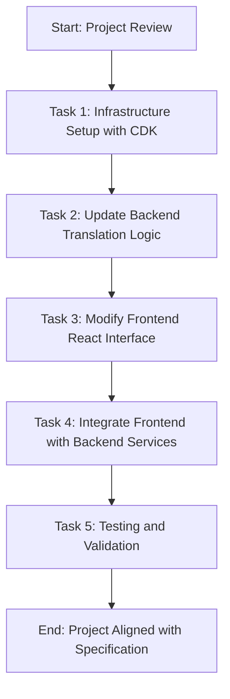

# Implementation Plan for PPT Translation App

This document outlines the approved plan to enhance the PPT Translation App, addressing identified issues and aligning the project with the product specification. The plan includes a strong focus on security configurations for AWS resources as requested.

## Mermaid Diagram of Implementation Workflow

## Task Breakdown with Security Focus

1. **Task 1: Infrastructure Setup with AWS CDK**
   - **Objective**: Define and deploy all required AWS resources with robust security configurations.
   - **Steps**:
     - Update `cdk/lib/cdk-stack.ts` to include S3 buckets for original and translated files, with server-side encryption enabled (e.g., SSE-S3 or SSE-KMS).
     - Define Lambda functions for event triggering on S3 uploads, with IAM roles granting least privilege access.
     - Set up ECS Fargate cluster and tasks for translation processing in Spot mode, configured within a VPC with private subnets and security groups restricting inbound traffic.
     - Create ECR repository for storing the translation container image, with repository policies limiting access to specific IAM roles.
     - Configure Amplify app for hosting the React frontend, ensuring secure authentication (e.g., via AWS Cognito if applicable).
     - Implement IAM policies across all resources to follow the principle of least privilege, ensuring each service can only access what it needs.
     - Enable AWS CloudTrail and Config for auditing and compliance monitoring of resource configurations.
     - Deploy the stack using `cdk synth` and `cdk deploy`.
   - **Deliverable**: Fully configured AWS infrastructure with enhanced security measures, ready for app deployment.

2. **Task 2: Update Backend Translation Logic**
   - **Objective**: Align the Python translation app with the specification.
   - **Steps**:
     - Modify `translator-app/main.py` to fix the target language to Traditional Chinese (Taiwan) using the appropriate language code (e.g., 'zh-Hant-TW').
     - Restructure the script to run as a containerized application on ECS Fargate rather than a Lambda function.
     - Verify or implement the `Bedrock` module for translation integration with Amazon Bedrock (Claude 3.7 model).
     - Build and push the Docker image to ECR.
   - **Deliverable**: Backend application ready for containerized deployment with correct language targeting.

3. **Task 3: Modify Frontend React Interface**
   - **Objective**: Ensure the UI reflects the fixed target language requirement.
   - **Steps**:
     - Update `web-ui/src/App.js` to set a fixed target language of Traditional Chinese (Taiwan) and consider disabling the target language selector.
     - Enhance UI clarity for source language selection if needed.
   - **Deliverable**: User interface aligned with the specification for language targeting.

4. **Task 4: Integrate Frontend with Backend Services**
   - **Objective**: Connect the React app to actual backend services.
   - **Steps**:
     - Update `web-ui/src/services/aws-service.js` to replace simulated responses with real API calls to backend endpoints for translation requests, status checks, and file retrieval.
     - Ensure proper AWS SDK configuration for authentication and region settings.
   - **Deliverable**: Fully integrated frontend-backend communication for a functional application.

5. **Task 5: Testing and Validation**
   - **Objective**: Verify that all components work together as intended.
   - **Steps**:
     - Test infrastructure deployment via AWS Console and CDK commands, including security configurations like encryption and access policies.
     - Perform unit and integration tests for backend translation logic.
     - Conduct end-to-end testing for the React app, including file upload, translation initiation, progress tracking, and download.
     - Validate translation accuracy to Traditional Chinese (Taiwan) using sample PowerPoint files.
     - Perform security audits to ensure no vulnerabilities in access controls or data handling.
   - **Deliverable**: A validated, fully functional PPT Translation App meeting all specified requirements with robust security.