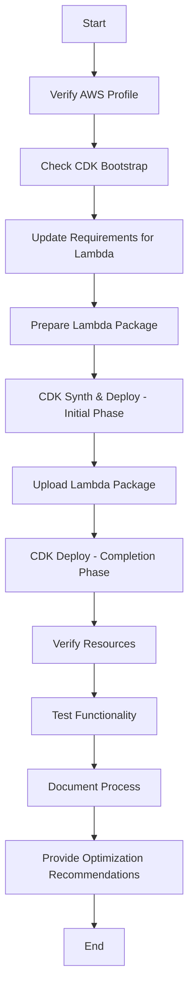

# Deployment Process for PowerPoint Translator Project

**Objective**: To deploy the PowerPoint Translator infrastructure for testing, ensuring all prerequisites are met, including building and pushing the Docker image to ECR in the correct sequence (if applicable), establishing front-end and back-end associations, and documenting the process thoroughly while providing optimization recommendations for future iterations. Due to issues with ECR image push, the architecture has been updated to use Lambda for the translator-app instead of ECS Fargate.

## Step-by-Step Deployment Workflow

1. **Pre-Deployment Prerequisites**
   - **Verify AWS Profile Configuration**: Ensure the AWS profile `gd-developer` is configured correctly with the necessary permissions for CDK operations, ECR access, and other AWS services involved.
   - **Check CDK Bootstrap Status**: Confirm that the AWS environment has been bootstrapped for CDK. If not, run `cdk bootstrap --profile gd-developer` to set up the necessary resources.
   - **Update Requirements**: Update the `translator-app/requirements.txt` to match the dependencies used in `main.py` for Lambda execution.
     - **Updated Requirements**: `requirements.txt` has been updated to include:
       ```
       boto3
       python-pptx
       botocore>=1.29.0
       tqdm
       ```
   - **Prepare Lambda Package**: Package the translator application for Lambda deployment. Since Lambda does not use Docker images, the previous step of building a Docker image is no longer applicable. Instead, create a deployment package (ZIP file) containing the application code and dependencies:
     ```
     cd /Users/hclo/Documents/Projects/ppt-translator/translator-app && mkdir -p lambda-package && pip install -r requirements.txt -t lambda-package && cp main.py lambda-package/ && cd lambda-package && zip -r ../translator-app.zip .
     ```
     This step ensures the application is ready for Lambda deployment.

2. **CDK Stack Deployment - Initial Phase (Core Infrastructure)**
   - **Navigate to CDK Directory**: Ensure commands are run from the correct directory:
     ```
     cd /Users/hclo/Documents/Projects/ppt-translator/cdk
     ```
   - **Synthesize CDK Stack**: Run `cdk synth --profile gd-developer` to generate the CloudFormation template and check for any syntax or configuration errors. This step was completed successfully.
   - **Update CDK Stack for Lambda**: Modify the CDK stack definition to replace ECS Fargate with Lambda for the translator application. Update `cdk/lib/cdk-stack.ts` to define a Lambda function instead of an ECS service for translation processing. Ensure the Lambda function is triggered by S3 events from the original files bucket. This has been completed.
   - **Unique Stack Naming**: Ensure each deployment has a unique stack name to avoid conflicts with previous deployments. Use a timestamp or a unique suffix in the stack name. Update the stack name in `cdk/bin/cdk.ts` or pass a unique stack name during deployment:
     ```
     cdk deploy PPTTranslationStack-$(date +%s) --force --profile gd-developer
     ```
     Replace `PPTTranslationStack-$(date +%s)` with a unique name for each deployment.
   - **Deploy CDK Stack**: Deploy the infrastructure using the unique stack name:
     ```
     cdk deploy <UNIQUE_STACK_NAME> --force --profile gd-developer
     ```
     The `--force` flag ensures updates to existing resources if necessary. The deployment was previously interrupted, so verify the current state of resources before proceeding. Monitor the deployment progress for the creation of necessary resources like S3 buckets, Lambda functions, and CloudFront distribution.

3. **Lambda Deployment (Post-Infrastructure Setup)**
   - **Upload Lambda Package**: After the Lambda function is defined in the CDK stack, upload the deployment package to the Lambda function:
     ```
     aws lambda update-function-code --function-name <TRANSLATION_LAMBDA_NAME> --zip-file fileb://translator-app.zip --profile gd-developer
     ```
     Replace `<TRANSLATION_LAMBDA_NAME>` with the actual name of the Lambda function created by CDK. This step ensures the Lambda function has the latest code for processing translations.

4. **CDK Stack Deployment - Completion Phase**
   - If the initial CDK deployment is still in progress, it will continue to deploy the remaining resources. If it was interrupted, resume or update the stack with:
     ```
     cdk deploy <UNIQUE_STACK_NAME> --force --profile gd-developer
     ```
   - Monitor the deployment to ensure all resources are created correctly with the updated Lambda-based architecture.

5. **Post-Deployment Verification**
   - **Check Resource Status**: Verify the status of each AWS resource created (S3 buckets, Lambda functions, and Amplify apps) via the AWS Management Console or CLI to confirm they are operational as per `task1-infrastructure-setup.md`.
   - **Test Functionality**: Perform basic tests to ensure each component functions as expected, such as uploading a file to the original S3 bucket to trigger the Lambda function for translation.

6. **Documentation**
   - **Record Deployment Steps**: Document every command executed, outputs received, errors encountered, and resolutions applied in this file, `memory-bank/deployment-process.md`.
   - **Include Logs**: Capture detailed logs from the CDK deployment and Lambda deployment processes for reference. Logs up to the interruption point have been included.

7. **Optimization Recommendations**
   - **Automation Scripts**: Develop shell scripts to automate the sequence of packaging the Lambda application, uploading to AWS, and deploying the CDK stack to reduce manual errors.
   - **CI/CD Pipeline**: Implement a CI/CD pipeline using GitHub Actions to automate the packaging, upload, and deployment process on code changes or commits. A sample workflow could include steps for Lambda package creation/upload and CDK deployment triggered on push to a specific branch.
   - **Infrastructure as Code Best Practices**: Use CDK context variables or parameters to ensure unique resource naming for each deployment, as implemented in the recent code update.
   - **AWS Deployment Tools**: Leverage AWS CodePipeline and CodeBuild for a more integrated deployment process within the AWS ecosystem, ensuring prerequisites like Lambda package availability are met before stack updates.
   - **Lambda Optimization**: Optimize Lambda execution time and memory usage for processing large PowerPoint files. Consider breaking down large files into smaller chunks if necessary to stay within Lambda execution limits.

## Mermaid Diagram of Updated Deployment Workflow



This revised plan reflects the change in architecture from ECS Fargate to Lambda for the translator application due to issues with pushing the Docker image to ECR. The process now focuses on packaging the application for Lambda, updating the CDK stack to use Lambda instead of ECS, and deploying the infrastructure accordingly. Additionally, it incorporates a unique stack naming strategy to avoid conflicts with previous deployments. The deployment was previously interrupted, and the next steps involve verifying the current state of deployed resources and resuming or restarting the deployment process with the updated architecture and unique stack name.