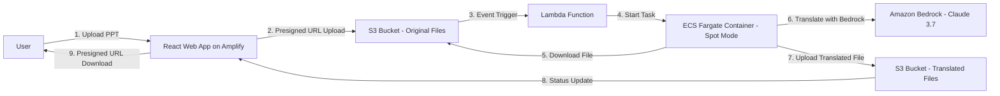

# System Patterns: PPT Translation App

## System Architecture
The PPT Translation App follows a serverless, event-driven architecture leveraging AWS services for scalability and cost efficiency. The architecture consists of the following key components:

## Key Technical Decisions
1. **Serverless First**: Using serverless components (Lambda, Fargate) to minimize operational overhead and enable automatic scaling.
2. **Event-Driven Processing**: S3 events trigger Lambda functions to initiate processing, creating a loosely coupled system.
3. **Container-Based Processing**: Packaging the translation logic in a container for portability and isolation.
4. **Cost Optimization**: Using Fargate Spot instances to reduce processing costs while maintaining scalability.
5. **Secure File Handling**: Implementing presigned URLs for secure, temporary access to S3 objects without exposing bucket permissions.
6. **Infrastructure as Code**: Defining all resources with AWS CDK to ensure consistency and repeatability.

## Design Patterns
1. **Event-Driven Architecture**: The system responds to events (file uploads) rather than continuous polling, improving efficiency.
2. **Microservices**: Each component (web interface, file processing, translation) is isolated and independently deployable.
3. **Asynchronous Processing**: File translation happens asynchronously, allowing the user to continue other tasks while processing occurs.
4. **Stateless Processing**: The Fargate container is stateless, with all persistent data stored in S3, enabling horizontal scaling.
5. **Circuit Breaker**: Implementing retry mechanisms and fallbacks for Bedrock API calls and Spot instance interruptions.

## Component Relationships
- **Web App ↔ S3**: The React app generates presigned URLs for upload/download and polls for status updates.
- **S3 → Lambda**: S3 events trigger Lambda functions when files are uploaded.
- **Lambda → ECS Fargate**: Lambda initiates Fargate tasks with parameters from the S3 event.
- **Fargate ↔ S3**: The container downloads files from S3, processes them, and uploads results back.
- **Fargate ↔ Bedrock**: The container calls Bedrock API for translation services.
- **Web App → User**: The app provides status updates and download links to the user.

## Critical Implementation Paths
1. **File Upload Path**:
   - User selects a file in the web app.
   - App requests a presigned URL from the backend.
   - File is uploaded directly to S3 using the presigned URL.
   - S3 event notification triggers Lambda.
   - Lambda starts a Fargate task with file information.

2. **Translation Processing Path**:
   - Fargate container starts and downloads the file using a presigned URL.
   - Container extracts text from PPT using python-pptx.
   - Text is sent to Bedrock for translation with custom instructions.
   - Translated text is inserted back into the PPT.
   - Translated file is uploaded to S3.

3. **Status Update and Download Path**:
   - Web app polls for status updates (or receives notifications).
   - When translation is complete, app generates a presigned download URL.
   - User downloads the translated file using the presigned URL.

## Resilience Strategies
- **Spot Instance Handling**: Implement checkpointing or task resumption for Fargate Spot interruptions.
- **API Rate Limiting**: Implement backoff strategies for Bedrock API calls to handle rate limits.
- **Error Recovery**: Store processing state in S3 or DynamoDB to enable recovery from failures.
