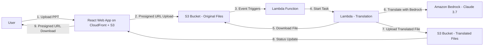

# Product Specification: PowerPoint Translator App

## Overview
This document outlines the detailed plan and architecture for the PowerPoint Translator App, as derived from the project requirements. The app enables users to upload PPTX files for translation to Traditional Chinese (zh-TW, Taiwan), with a simple web interface for progress tracking and downloads. The solution leverages AWS cloud services, is mainly serverless, and is packaged using AWS CDK.

## Architecture Diagram
Below is the Mermaid diagram illustrating the process flow and architecture:

## Architecture Components
- **WebUI**: Hosted on CloudFront + S3, providing a React-based interface for user interaction.
- **Authentication**: OAuth mechanism integrated with Cognito for secure login via CloudFront portal.
- **Storage**: Two S3 buckets - one for uploaded original files and one for translated files, with translated files named as `xxx_zh-TW_timestamp.pptx`.
- **Logic**: Operates on Lambda for event handling and processing.
- **Translation**: Performed using Amazon Bedrock invoke model (Claude 3.7).

## Test Success Conditions
The following conditions must be met to consider the project successfully tested:
- Users can log in to the WebUI by entering account and password through the CloudFront portal.
- WebUI allows file uploads through presigned URLs.
- WebUI can track the translation progress.
- WebUI provides downloads through presigned URLs.

## Detailed Plan
The implementation plan includes the following tasks:

1. **Infrastructure Setup with AWS CDK**  
   - Objective: Define and deploy AWS resources.
   - User Story: As a developer, I want to provision AWS infrastructure so that the app can be deployed reliably.
   - Design Details: Use AWS CDK to create S3 buckets, Lambda functions, CloudFront distribution for WebUI hosting, Cognito User Pool for OAuth, and related resources.
   - Execution Details: Update the existing CDK project; run `cdk synth` and `cdk deploy`.
   - Test Scope: Verify resource creation via AWS Console; test CDK deployment commands.

2. **S3 Storage with Presigned URLs**  
   - Objective: Enable secure file uploads and downloads.
   - User Story: As a user, I want to upload and download files securely without exposing bucket access.
   - Design Details: Configure S3 buckets with event notifications and generate presigned URLs via Lambda.
   - Execution Details: Implement S3 bucket policies and Lambda functions for URL generation.
   - Test Scope: Test presigned URL generation and expiration; verify file upload/download.

3. **React Web Interface on CloudFront + S3**  
   - Objective: Build and deploy a lightweight web app.
   - User Story: As a user, I want an intuitive interface to upload files, track progress, and download results.
   - Design Details: Use React for the frontend with components for upload, progress bar, download, and OAuth login via Cognito. Host static files on S3 with CloudFront distribution for secure access.
   - Execution Details: Develop React app; integrate AWS SDK; deploy static files to S3 with CloudFront configuration.
   - Test Scope: Unit tests for React components; end-to-end tests for user flows including login, upload, progress tracking, and download.

4. **Event Triggering with Lambda**  
   - Objective: Handle S3 events to start processing.
   - User Story: As a system administrator, I want S3 uploads to automatically trigger translation.
   - Design Details: Write Lambda function to parse events and invoke processing tasks.
   - Execution Details: Code Lambda in Python; configure S3 event triggers.
   - Test Scope: Simulate S3 events; verify Lambda invocation.

5. **Translation Processing on Lambda**  
   - Objective: Process and translate PPTX files in a Lambda function.
   - User Story: As a processor, I want to handle file translation efficiently.
   - Design Details: Use Python with `python-pptx`; run on Lambda.
   - Execution Details: Build and deploy Lambda function for translation.
   - Test Scope: Test Lambda function locally; verify Lambda execution.

6. **Integration with Amazon Bedrock for Translation**  
   - Objective: Perform translations using Bedrock.
   - User Story: As a translator, I want dynamic model selection for accurate translations.
   - Design Details: Implement Bedrock API calls in the Lambda function; start with Claude 3.7.
   - Execution Details: Add Bedrock integration code; handle API requests.
   - Test Scope: Mock Bedrock responses; test translation accuracy and file naming convention `xxx_zh-TW_timestamp.pptx`.

## Version Control and Task Tracking
- Use Git for version control, with commits for each task completion.
- Track overall task status in 'memory-bank/progress.md', updating after each task.
- Complete one task at a time, starting with infrastructure setup.
