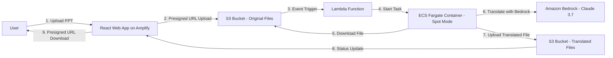

# Product Specification: PPT Translation App

## Overview
This document outlines the detailed plan and architecture for the PPT Translation App, as derived from the project requirements. The app enables users to upload PPT files for translation to Traditional Chinese (Taiwan), with a simple web interface for progress tracking and downloads. The solution leverages AWS services and is packaged using AWS CDK.

## Architecture Diagram
Below is the Mermaid diagram illustrating the process flow and architecture:

## Detailed Plan
The implementation plan includes the following tasks:

1. **Infrastructure Setup with AWS CDK**  
   - Objective: Define and deploy AWS resources.
   - User Story: As a developer, I want to provision AWS infrastructure so that the app can be deployed reliably.
   - Design Details: Use AWS CDK to create S3 buckets, Lambda functions, ECS Fargate clusters, ECR repositories, and Amplify apps.
   - Execution Details: Update the existing CDK project; run `cdk synth` and `cdk deploy`.
   - Test Scope: Verify resource creation via AWS Console; test CDK deployment commands.

2. **S3 Storage with Presigned URLs**  
   - Objective: Enable secure file uploads and downloads.
   - User Story: As a user, I want to upload and download files securely without exposing bucket access.
   - Design Details: Configure S3 buckets with event notifications and generate presigned URLs via Lambda or API.
   - Execution Details: Implement S3 bucket policies and Lambda functions for URL generation.
   - Test Scope: Test presigned URL generation and expiration; verify file upload/download.

3. **React Web Interface on AWS Amplify**  
   - Objective: Build and deploy a lightweight web app.
   - User Story: As a user, I want an intuitive interface to upload files, track progress, and download results.
   - Design Details: Use React for the frontend with components for upload, progress bar, and download.
   - Execution Details: Develop React app; integrate AWS SDK; deploy to Amplify.
   - Test Scope: Unit tests for React components; end-to-end tests for user flows.

4. **Event Triggering with Lambda**  
   - Objective: Handle S3 events to start processing.
   - User Story: As a system administrator, I want S3 uploads to automatically trigger translation.
   - Design Details: Write Lambda function to parse events and invoke ECS tasks.
   - Execution Details: Code Lambda in Python; configure S3 event triggers.
   - Test Scope: Simulate S3 events; verify Lambda invocation.

5. **Translation Processing Container on ECS Fargate**  
   - Objective: Process and translate PPT files in a container.
   - User Story: As a processor, I want to handle file translation efficiently.
   - Design Details: Use Python with `python-pptx`; containerize with Docker; run on Fargate in Spot mode.
   - Execution Details: Build and push Docker image to ECR; configure Fargate tasks.
   - Test Scope: Test container locally; verify Fargate task execution and Spot mode.

6. **Integration with Amazon Bedrock for Translation**  
   - Objective: Perform translations using Bedrock.
   - User Story: As a translator, I want dynamic model selection for accurate translations.
   - Design Details: Implement Bedrock API calls in the container; start with Claude 3.7.
   - Execution Details: Add Bedrock integration code; handle API requests.
   - Test Scope: Mock Bedrock responses; test translation accuracy.

## Version Control and Task Tracking
- Use Git for version control, with commits for each task completion.
- Track overall task status in 'memory-bank/progress.md', updating after each task.
- Complete one task at a time, starting with infrastructure setup.
